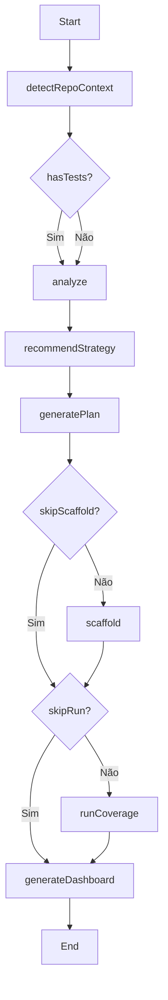
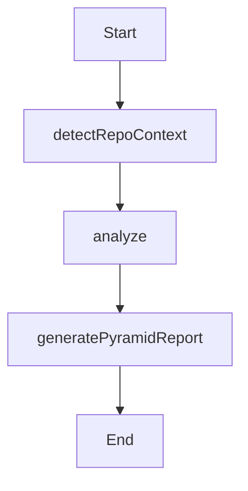
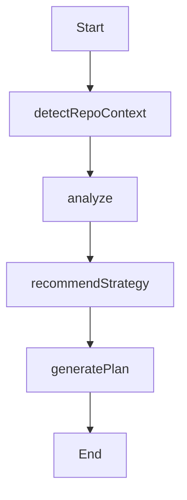

# 🚀 Guia do Orquestrador Auto - O Comando Mágico!

Este guia explica como usar a tool `auto` do Quality MCP para executar análises de qualidade automatizadas com **zero-setup** e suporte para **8+ linguagens**.

**NOVO v0.3.1**: 🌍 **Suporte Multi-Linguagem!** Agora funciona com Go, Java, Python, Ruby, C#, PHP, Rust, além de JavaScript/TypeScript!

---

## 🎯 O Comando Mágico (TL;DR)

```bash
# Para qualquer projeto (detecta linguagem automaticamente)
quality auto --repo /path/to/projeto --product "nome-projeto"

# Exemplo Go
quality auto --repo /Volumes/Dev/npm-malicious-scanner --product "npm-malicious-scanner"

# Exemplo JavaScript/TypeScript
quality auto --repo . --product "meu-app"
```

**O que acontece:**
1. ✅ Detecta linguagem (Go, Java, Python, etc)
2. ✅ Analisa todo o código
3. ✅ Calcula cobertura de testes
4. ✅ Mostra pirâmide de testes
5. ✅ Recomenda estratégia
6. ✅ Gera plano detalhado
7. ✅ Mostra o que precisa ser testado

**Tudo isso em UM ÚNICO COMANDO! 🎉**

---

## 📖 Índice

- [Visão Geral](#visão-geral)
- [Modos de Execução](#modos-de-execução)
- [Auto-Detecção](#auto-detecção)
- [Parâmetros](#parâmetros)
- [Fluxos de Execução](#fluxos-de-execução)
- [Artifacts Gerados](#artifacts-gerados)
- [Exemplos Práticos](#exemplos-práticos)
- [Troubleshooting](#troubleshooting)

---

## Visão Geral

A tool `auto` é o **orquestrador principal** do Quality MCP. Ela:

1. **Auto-detecta** o contexto do repositório
2. **Executa** o fluxo apropriado baseado no modo
3. **Gera** artifacts organizados em `qa/<produto>/`

### Características

- ✅ **Zero-setup**: Funciona sem configuração prévia
- ✅ **Inteligente**: Detecta produto, testes, framework
- ✅ **Flexível**: 5 modos de execução diferentes
- ✅ **Completo**: Integra todas as ferramentas do MCP

---

## Modos de Execução

### Sintaxe Básica

```json
{
  "tool": "auto",
  "params": {
    "mode": "full"  // full | analyze | plan | scaffold | run
  }
}
```

---

### 1. FULL (Completo) - Padrão

**Quando usar**: Setup completo do zero, análise end-to-end.

**O que faz**:
```
1. detectRepoContext()
   ↓ Detecta: repo, produto, testes, framework
   
2. analyze()
   ↓ Mapeia: rotas, endpoints, eventos
   
3. recommendTestStrategy()
   ↓ Recomenda: % unit/int/e2e
   
4. generatePyramidReport()
   ↓ Visualiza: pirâmide atual
   
5. generatePlan()
   ↓ Cria: TEST-PLAN.md
   
6. scaffoldUnitTests() + scaffoldIntegrationTests() + scaffoldPlaywright()
   ↓ Gera: templates de testes
   
7. runCoverageAnalysis()
   ↓ Executa: testes + cobertura
   
8. generatePyramidReport()
   ↓ Atualiza: pirâmide pós-testes
   
9. generateDashboard()
   ↓ Cria: SUMMARY.md executivo
```

**Exemplo**:
```json
{
  "tool": "auto",
  "params": {
    "mode": "full"
  }
}
```

**Artifacts**:
- `analyze.json`
- `pyramid-report.json`
- `TEST-STRATEGY-RECOMMENDATION.md`
- `TEST-PLAN.md`
- `tests/unit/*.test.ts` (scaffolds)
- `tests/integration/*.spec.ts` (scaffolds)
- `tests/e2e/*.spec.ts` (scaffolds)
- `coverage-analysis.json`
- `SUMMARY.md`

---

### 2. ANALYZE (Apenas Análise)

**Quando usar**: Mapear código sem gerar testes, análise rápida.

**O que faz**:
```
1. detectRepoContext()
2. analyze()
3. generatePyramidReport()
```

**Exemplo**:
```json
{
  "tool": "auto",
  "params": {
    "mode": "analyze",
    "repo": "/path/to/repo",
    "product": "MyApp"
  }
}
```

**Artifacts**:
- `analyze.json`
- `pyramid-report.json`

**Tempo**: ~10-30 segundos

---

### 3. PLAN (Análise + Plano)

**Quando usar**: Criar estratégia de testes sem implementar.

**O que faz**:
```
1. detectRepoContext()
2. analyze()
3. recommendTestStrategy()
4. generatePlan()
```

**Exemplo**:
```json
{
  "tool": "auto",
  "params": {
    "mode": "plan"
  }
}
```

**Artifacts**:
- `analyze.json`
- `pyramid-report.json`
- `TEST-STRATEGY-RECOMMENDATION.md`
- `TEST-PLAN.md`

**Tempo**: ~20-60 segundos

---

### 4. SCAFFOLD (Análise + Plano + Templates)

**Quando usar**: Gerar estrutura de testes, kickstart de projeto.

**O que faz**:
```
1. detectRepoContext()
2. analyze()
3. generatePlan()
4. scaffoldUnitTests()
5. scaffoldIntegrationTests()
6. scaffoldPlaywright()
```

**Exemplo**:
```json
{
  "tool": "auto",
  "params": {
    "mode": "scaffold"
  }
}
```

**Artifacts**:
- `analyze.json`
- `TEST-PLAN.md`
- `tests/unit/*.test.ts`
- `tests/integration/*.spec.ts`
- `tests/e2e/*.spec.ts`
- `playwright.config.ts`

**Tempo**: ~30-90 segundos

---

### 5. RUN (Executar Testes)

**Quando usar**: Validar testes existentes, calcular cobertura, CI/CD.

**O que faz**:
```
1. detectRepoContext()
2. runCoverageAnalysis()
3. generatePyramidReport()
4. generateDashboard()
```

**Exemplo**:
```json
{
  "tool": "auto",
  "params": {
    "mode": "run"
  }
}
```

**Artifacts**:
- `coverage-analysis.json`
- `pyramid-report.json`
- `SUMMARY.md`

**Tempo**: Depende da suíte de testes (30s - 10min)

---

## Auto-Detecção

O `auto` detecta automaticamente:

### 1. Repositório

**Busca ascendente por**:
- Parâmetro `repo` explícito
- `process.cwd()` (diretório atual)
- `.git/` (busca em diretórios pais)
- `package.json` (busca em diretórios pais)

**Exemplo**:
```
/workspace/
  ├── my-app/
  │   ├── .git/           ← Encontrado aqui
  │   ├── package.json
  │   └── src/
```

### 2. Produto

**Inferência**:
1. Parâmetro `product` explícito
2. `package.json` → `name` field
3. `basename(repoPath)` (nome da pasta)

**Exemplo**:
```json
// package.json
{
  "name": "@company/billing-service"
}
// → Produto detectado: "billing-service"
```

### 3. Testes Existentes

**Busca recursiva em**:
- `tests/`
- `test/`
- `__tests__/`
- `spec/`
- `qa/`

**Padrões**:
- `*.test.ts`
- `*.test.js`
- `*.spec.ts`
- `*.spec.js`

### 4. Framework de Testes

**Detecta via `package.json` devDependencies**:
- `vitest` → "vitest"
- `jest` → "jest"
- `mocha` → "mocha"

### 5. Linguagem

**Detecta via**:
- `tsconfig.json` → "typescript"
- `package.json` → "javascript"

---

## Parâmetros

### mode

- **Tipo**: `'full' | 'analyze' | 'plan' | 'scaffold' | 'run'`
- **Padrão**: `'full'`
- **Descrição**: Modo de execução

```json
{ "mode": "analyze" }
```

### repo

- **Tipo**: `string`
- **Padrão**: Auto-detectado
- **Descrição**: Caminho do repositório

```json
{ "repo": "/workspace/my-app" }
```

### product

- **Tipo**: `string`
- **Padrão**: Inferido do `package.json` ou nome da pasta
- **Descrição**: Nome do produto

```json
{ "product": "BillingService" }
```

### skipScaffold

- **Tipo**: `boolean`
- **Padrão**: `false`
- **Descrição**: Pular geração de scaffolds (útil se já existem testes)

```json
{ "skipScaffold": true }
```

### skipRun

- **Tipo**: `boolean`
- **Padrão**: `false`
- **Descrição**: Pular execução de testes (útil para análise rápida)

```json
{ "skipRun": true }
```

---

## Fluxos de Execução

### Fluxo: FULL



### Fluxo: ANALYZE



### Fluxo: PLAN



---

## Artifacts Gerados

### Estrutura de Diretórios

```
qa/
└── <produto>/
    ├── mcp-settings.json          # Config (auto-gerada)
    └── tests/
        ├── unit/                  # Testes unitários
        │   └── *.test.ts
        ├── integration/           # Testes de integração
        │   └── *.spec.ts
        ├── e2e/                   # Testes E2E
        │   └── *.spec.ts
        └── analyses/              # Análises e relatórios
            ├── analyze.json
            ├── pyramid-report.json
            ├── TEST-STRATEGY-RECOMMENDATION.md
            ├── TEST-PLAN.md
            ├── coverage-analysis.json
            └── SUMMARY.md
```

### Artifacts por Modo

| Artifact | FULL | ANALYZE | PLAN | SCAFFOLD | RUN |
|----------|------|---------|------|----------|-----|
| `analyze.json` | ✅ | ✅ | ✅ | ✅ | ✅ |
| `pyramid-report.json` | ✅ | ✅ | ✅ | ✅ | ✅ |
| `TEST-STRATEGY-RECOMMENDATION.md` | ✅ | ❌ | ✅ | ✅ | ❌ |
| `TEST-PLAN.md` | ✅ | ❌ | ✅ | ✅ | ❌ |
| `tests/unit/*.test.ts` | ✅ | ❌ | ❌ | ✅ | ❌ |
| `tests/integration/*.spec.ts` | ✅ | ❌ | ❌ | ✅ | ❌ |
| `tests/e2e/*.spec.ts` | ✅ | ❌ | ❌ | ✅ | ❌ |
| `coverage-analysis.json` | ✅ | ❌ | ❌ | ❌ | ✅ |
| `SUMMARY.md` | ✅ | ❌ | ❌ | ❌ | ✅ |

---

## Exemplos Práticos

### Exemplo 1: Setup Completo (Projeto Novo)

**Cenário**: Desenvolvedor clona repo novo e quer tudo configurado.

```json
{
  "tool": "auto",
  "params": {
    "mode": "full"
  }
}
```

**Resultado**:
- Cria `qa/my-app/mcp-settings.json`
- Analisa código
- Gera plano estratégico
- Cria 50+ scaffolds de testes
- Executa testes (vazios, todos passam)
- Gera relatório com próximos passos

---

### Exemplo 2: Análise Rápida (Projeto Existente)

**Cenário**: Lead quer visão geral sem rodar testes.

```json
{
  "tool": "auto",
  "params": {
    "mode": "analyze",
    "repo": "/workspace/legacy-app",
    "product": "LegacyApp"
  }
}
```

**Resultado**:
- Mapeia 200+ endpoints
- Detecta 15 testes E2E
- Gera pyramid report: **INVERTIDA** ❌
  - Unit: 5%
  - Integration: 10%
  - E2E: 85%
- Recomenda criar 100+ unit tests

---

### Exemplo 3: CI/CD Gate

**Cenário**: Pipeline valida cobertura do PR.

```json
{
  "tool": "auto",
  "params": {
    "mode": "run",
    "skipScaffold": true  // Não criar templates no CI
  }
}
```

**Resultado**:
- Executa testes existentes (3min)
- Calcula cobertura: 75%
- Calcula diff vs `main`: 82% ✅
- Gera `SUMMARY.md`
- Exit code: 0 (aprovado)

---

### Exemplo 4: Scaffold Only

**Cenário**: QA quer templates mas não executar.

```json
{
  "tool": "auto",
  "params": {
    "mode": "scaffold",
    "skipRun": true
  }
}
```

**Resultado**:
- Cria 30 unit tests
- Cria 10 integration tests
- Cria 5 E2E specs
- **Não** executa testes
- Tempo: 45s

---

### Exemplo 5: Projeto Específico

**Cenário**: Múltiplos projetos no monorepo.

```json
{
  "tool": "auto",
  "params": {
    "mode": "full",
    "repo": "/workspace/monorepo/packages/billing",
    "product": "BillingService"
  }
}
```

**Resultado**:
- Cria `qa/BillingService/`
- Analisa apenas `packages/billing/`
- Gera plano específico
- Isola artifacts por produto

---

## Troubleshooting

### Produto não detectado corretamente

**Sintoma**: Produto detectado como "monorepo" ou pasta raiz.

**Causa**: `package.json` não tem `name` ou está muito genérico.

**Solução**: Especifique explicitamente:
```json
{
  "mode": "full",
  "product": "MyApp"
}
```

---

### Testes não detectados

**Sintoma**: `hasTests: false` mas testes existem.

**Causa**: Testes em diretório não padrão.

**Solução**: Organize testes em:
- `tests/`
- `test/`
- `__tests__/`
- `spec/`

---

### Scaffold duplicado

**Sintoma**: Scaffolds criados mesmo já tendo testes.

**Causa**: Auto não detectou testes existentes.

**Solução**: Use `skipScaffold`:
```json
{
  "mode": "full",
  "skipScaffold": true
}
```

---

### Execução muito lenta

**Sintoma**: Modo FULL demora 10+ minutos.

**Causa**: Suite de testes grande ou pesada.

**Solução**: Use modos parciais:
```json
// Apenas análise (rápido)
{ "mode": "analyze" }

// Análise + plano (médio)
{ "mode": "plan" }

// Análise + plano + scaffold (sem run)
{
  "mode": "scaffold",
  "skipRun": true
}
```

---

## Performance

### Tempo Estimado por Modo

| Modo | Pequeno (< 50 arquivos) | Médio (50-200) | Grande (200+) |
|------|-------------------------|----------------|---------------|
| **ANALYZE** | 5-10s | 15-30s | 30-60s |
| **PLAN** | 10-20s | 30-60s | 1-2min |
| **SCAFFOLD** | 20-30s | 1-2min | 2-5min |
| **RUN** | 30s-2min | 2-5min | 5-15min |
| **FULL** | 1-3min | 3-7min | 7-20min |

### Otimizações

1. **Use ANALYZE para exploração rápida**
   ```json
   { "mode": "analyze" }
   ```

2. **Pule scaffold se já existem testes**
   ```json
   { "mode": "full", "skipScaffold": true }
   ```

3. **Pule run para análise sem execução**
   ```json
   { "mode": "plan", "skipRun": true }
   ```

4. **Cache artifacts**
   - `analyze.json` pode ser reusado
   - Evite re-análise se código não mudou

---

## Integração com CI/CD

### GitHub Actions

```yaml
name: Quality Gate
on: [pull_request]

jobs:
  quality:
    runs-on: ubuntu-latest
    steps:
      - uses: actions/checkout@v3
      
      - name: Setup Node
        uses: actions/setup-node@v3
        with:
          node-version: '20'
      
      - name: Install Quality MCP
        run: npm install -g @quality/mcp
      
      - name: Run Quality Analysis
        run: |
          quality-mcp auto '{
            "mode": "run",
            "skipScaffold": true
          }'
      
      - name: Upload Results
        uses: actions/upload-artifact@v3
        with:
          name: quality-report
          path: qa/*/tests/analyses/SUMMARY.md
```

---

**Versão**: 0.3.0  
**Última atualização**: 2025-11-01
